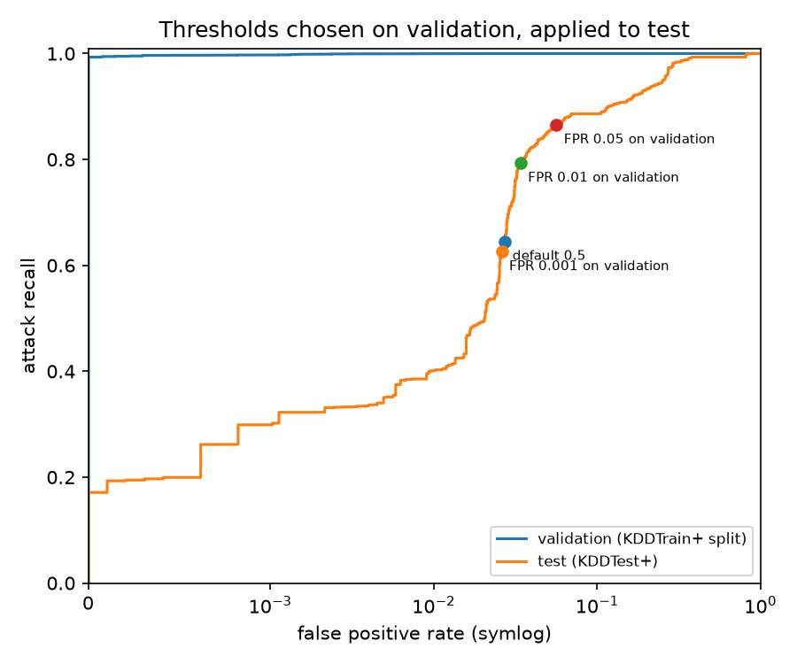
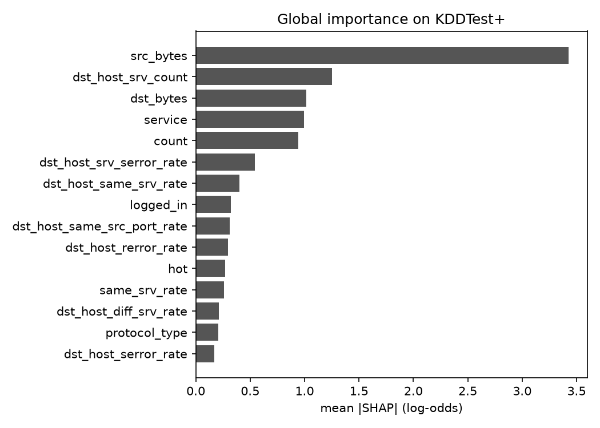
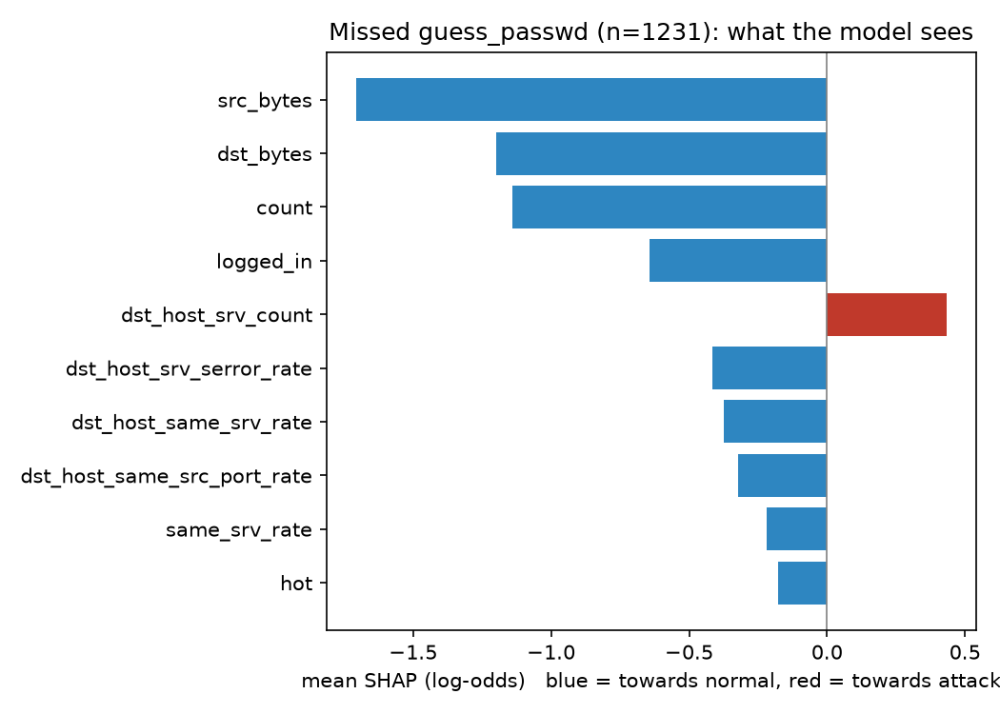

# Network Intrusion Detection

**Why 99 % accuracy in a notebook says almost nothing about a detector in deployment.**

A network intrusion classifier trained on NSL-KDD, evaluated the way it would actually be
used, and explained with SHAP. The model is not the point. The measurements are.

| Evaluation | Accuracy | Attacks caught | Never-seen attack types caught |
|---|---|---|---|
| Random split of the training file | **99.9 %** | 99.7 % | n/a |
| Official test file | **77.8 %** | 63.1 % | 29.3 % |

Same model, same code, two ways of measuring.

---

## Origin

This started as an internship project: predict whether a machine is compromised from network
data, and explain each prediction. The first version was trained on a public dataset, scored
95 % in a notebook, and did not work on the host organisation's real security logs.

That version is preserved under the tag
[`v0-internship`](https://github.com/AYMANE-SNOUSSI/network-intrusion-detection/tree/v0-internship). Rebuilding it showed three problems:

- It was only ever evaluated on a random split of its own training data. The test file it
  shipped with had no labels.
- The "explanation model" was trained on four hand-written rows.
- Missing inputs were silently replaced with zeros, so any file produced a prediction, including
  files that had nothing in common with the training data. That is why the real logs gave
  answers instead of errors.

The real logs could never have worked: they describe endpoint security events, while the
model expects per-connection network statistics. Different data, not a bug to fix.

This repository measures that failure properly instead of hiding it. The real logs are not,
and will never be, part of it.

---

## Data

[NSL-KDD](https://www.unb.ca/cic/datasets/nsl.html) (Tavallaee et al., 2009): one row per
network connection, 41 features, labelled normal or one of 39 attack types, grouped in four
categories.

| Category | Meaning | Train | Test |
|---|---|---|---|
| DoS | Denial of service: flooding a server | 45 927 | 7 458 |
| Probe | Scanning a network for weaknesses | 11 656 | 2 421 |
| R2L | Remote to local: gaining access from outside (e.g. password guessing) | 995 | 2 887 |
| U2R | User to root: escalating privileges | 52 | 67 |
| normal | | 67 343 | 9 711 |

**The official test file contains 17 attack types absent from training** (3 750 rows).
Evaluating on it is the closest this dataset gets to deployment.

`src/data.py` downloads the files once and checks their SHA-256, so every run uses identical data.

---

## 1. The same model, measured two ways

`src/exp01_split_vs_official.py`, RandomForest, all 41 features.

| | Random split | Official test |
|---|---|---|
| Accuracy | 0.999 | **0.778** |
| Attack precision | 1.000 | 0.969 |
| Attack recall | 0.997 | **0.631** |
| False positive rate | 0.0003 | 0.027 |
| Recall, DoS | 1.000 | 0.828 |
| Recall, Probe | 0.994 | 0.720 |
| Recall, R2L | 0.945 | **0.058** |
| Recall, attack types seen in training | | 0.770 |
| Recall, attack types never seen | | **0.293** |

The random split only asks whether the model recognises attacks it has already seen. It does.
Remote intrusions (R2L) collapse from 94 % to 6 %, and even known attack types drop to 77 %:
the test file does not just add new attacks, it contains different traffic.

---

## 2. Does the choice of model fix it?

`src/exp02_model_comparison.py`. Trained on the training file, evaluated on the official test.
Tree models over 3 seeds, reported as mean ± std.

| Model | Accuracy | Attack recall | False positive rate | R2L recall | Novel types recall |
|---|---|---|---|---|---|
| Always "normal" (floor) | 0.431 | 0.000 | 0.000 | 0.000 | 0.000 |
| Logistic regression | 0.745 | 0.609 | 0.076 | 0.027 | 0.255 |
| RandomForest, 41 features | 0.774 ± 0.005 | 0.623 ± 0.009 | 0.027 | 0.050 ± 0.003 | 0.274 ± 0.030 |
| RandomForest, 10 features (internship design) | 0.726 ± 0.001 | 0.557 ± 0.002 | 0.050 | **0.207 ± 0.001** | 0.224 ± 0.006 |
| HistGradientBoosting | **0.798 ± 0.005** | **0.667 ± 0.009** | 0.028 | 0.068 ± 0.008 | **0.407 ± 0.031** |

- **The floor explains why accuracy is the wrong headline.** Predicting "normal" for everything
  scores 43 % here. On real traffic, where attacks are well under 1 %, it would score above 99 %
  while detecting nothing.
- **Boosting is genuinely better on unseen attacks** (0.41 vs 0.27, about four times the seed
  spread). RandomForest vs logistic regression on the same metric (0.27 vs 0.26) is within
  noise: no conclusion.
- **No model fixes the problem.** The best one still misses a third of attacks and more than
  nine intrusions out of ten.
- **The internship's 10-feature selection is not simply worse.** It loses on overall recall and
  doubles false alarms, but catches four times more R2L intrusions. Which model is "best"
  depends on which error costs more. Why feature selection helps on R2L is **not yet
  explained**.

---

## 3. Choosing the alert threshold

`src/exp03_threshold.py`. The model outputs a probability; an alert fires above a threshold.
The threshold is chosen on a validation split of the training file for a target false
positive rate, then applied unchanged to the official test.

Daily volumes assume a realistic network: 10 000 connections, 50 of them attacks.

| Threshold chosen for | FPR on validation | **FPR on test** | Attack recall on test | Attacks missed / day | False alerts / day | Alerts that are real |
|---|---|---|---|---|---|---|
| default 0.5 | 0.0015 | 0.027 | 0.645 | 17.7 | 272 | 10.6 % |
| FPR 0.001 | 0.0010 | **0.026** | 0.626 | 18.7 | 260 | 10.7 % |
| FPR 0.01 | 0.0099 | 0.034 | 0.793 | 10.4 | 339 | 10.5 % |
| FPR 0.05 | 0.0497 | 0.057 | 0.865 | 6.7 | 563 | 7.1 % |



- **A threshold tuned before deployment does not hold after it.** Asking for 1 false alert per
  1 000 normal connections gives 26. The threshold has to be re-estimated on live traffic,
  which is a monitoring requirement, not a modelling one.
- **Rare attacks drown in false alerts.** At 97 % precision on the test file, the model looks
  reliable. At a realistic base rate, nine alerts out of ten are false.
- The default 0.5 is not a decision. Lowering the threshold to 0.02 cuts missed attacks from
  18 to 10 per day at the cost of about 70 more false alerts. That trade-off belongs to the
  security team.

ROC-AUC: 1.000 on validation, 0.956 on test.

---

## 4. Explaining alerts, and explaining misses

`src/exp04_shap.py`, `src/explain.py`. SHAP assigns each input field a contribution to a
single prediction: positive pushes towards "attack", negative towards "normal", and the
contributions add up exactly to the model's output (checked at runtime). Contributions of
one-hot columns are summed back into their original field, so explanations read `service`,
not `service_http`.

**An explanation attached to an alert** (a `back` DoS attack, probability 0.99998):

| Field | Value | Contribution |
|---|---|---|
| src_bytes | 32 120 | +8.08 towards attack |
| hot | 1 | +4.49 towards attack |
| dst_bytes | 4 380 | −0.84 towards normal |
| service | http | −0.75 towards normal |



### Why password-guessing attacks are never caught

`guess_passwd` is a known attack type, present in training. **0 of 1 231 are detected.**

| | Training | Test |
|---|---|---|
| Examples | 53 | 1 231 |
| Service targeted | telnet 100 % | pop_3 61 %, telnet 31 %, ftp 8 % |
| Connection end state (`flag`) | RSTO (reset) 85 % | SF (normal close) 98 % |
| Mean failed logins | 1.06 | 0.38 |

Same label, different traffic. In training, password guessing always looked like an aborted
remote shell session. In test, it mostly targets a mail server with connections that close
cleanly. The model learned what the attack looked like in its 53 examples, not what the attack
is. SHAP confirms it: on the missed attacks, almost every field pushes towards "normal".



The same mechanism, at a larger scale, is why the internship version failed on real logs.

---

## Limitations

- **NSL-KDD dates from simulated 1998 traffic.** The conclusions are about evaluation
  methodology, not about modern attacks.
- **3 seeds** give a rough spread estimate: enough to reject small differences, not to rank
  close models precisely.
- SHAP explains what the model uses, not what causes an attack.
- One model family is explained (HistGradientBoosting, seed 0, threshold 0.5).

## What would make it work

| Option | Addresses the problem? |
|---|---|
| A different model or hyperparameters | No. Experiment 2: a few points at most. |
| A more recent public dataset (CIC-IDS2017, UNSW-NB15) | Partly. More modern, still someone else's network. |
| Labelled data from the target network, with identical feature extraction in training and in service | Yes. Requires infrastructure access and analysts to label. |
| Anomaly detection trained on normal traffic only | Promising for unseen attacks, usually at a higher false alert rate. **Not measured here.** |

In practice a model like this ranks alerts for analysts, alongside expert rules. It does not
decide alone.

---

## Reproduce

```bash
git clone https://github.com/AYMANE-SNOUSSI/network-intrusion-detection.git
cd network-intrusion-detection
python -m venv .venv
.venv\Scripts\activate          # Windows; source .venv/bin/activate elsewhere
pip install -r requirements.txt
cd src
python data.py                       # download + integrity check
python exp01_split_vs_official.py    # ~1 min
python exp02_model_comparison.py     # ~5 min on a laptop CPU
python exp03_threshold.py
python exp04_shap.py
```

Results are written to `reports/`. RandomForest results are identical across machines; the
boosting and logistic regression figures can differ in the third decimal because of
floating-point differences in parallel computation.

## Structure

```
network-intrusion-detection/
├── src/
│   ├── data.py                        # download, integrity check, attack taxonomy
│   ├── exp01_split_vs_official.py
│   ├── exp02_model_comparison.py
│   ├── exp03_threshold.py
│   ├── exp04_shap.py
│   └── explain.py                     # reusable per-prediction explanations
├── reports/                           # JSON results and figures
├── requirements.txt
└── README.md
```

## Next

A FastAPI service returning a prediction and its explanation, with strict input validation
(a missing field is an error, never a zero), packaged with Docker and tested in CI.

---

**Aymane Snoussi**
[LinkedIn](https://www.linkedin.com/in/aymane-snoussi-538561335/) · [GitHub](https://github.com/AYMANE-SNOUSSI)